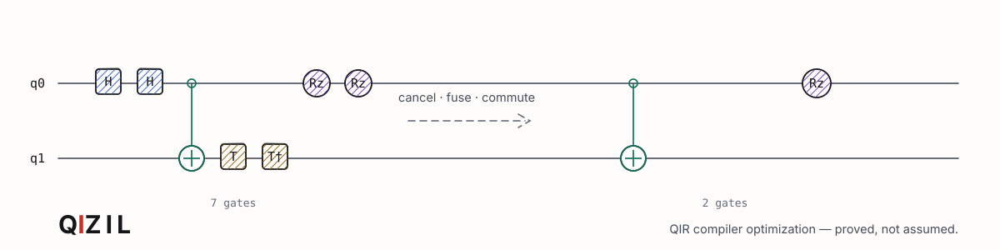
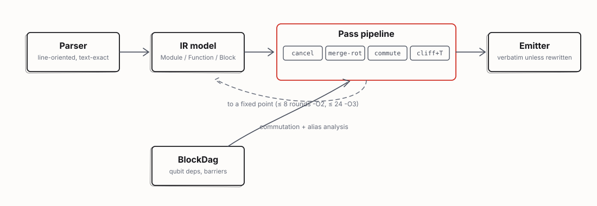

<p>
  
  
  
  
  
  <a href="LICENSE"></a>
</p>

> **Built for the Microsoft AI/ML Summer Internship Programme, 2026.**
> Capstone project by **Egemen Sarıaslan**, covering algorithm design, implementation, formal verification and benchmarking. Carried out under the supervision of Microsoft Cloud Solution Architects Management.
>
> <sub>A capstone project produced during the programme. Not a Microsoft product, not affiliated with or endorsed by Microsoft Corporation; Microsoft and Azure are their trademarks.</sub>

A compiler optimization pass for **QIR** — the LLVM-based intermediate representation Q#, Qiskit and PennyLane all lower to. Qizil reads a module as `.ll` or `.bc`, cancels and fuses redundant quantum gates, resynthesizes Clifford+T runs, and writes back optimized QIR — with every classical instruction, basic block, measurement and piece of metadata exactly where it was.

The name is the thesis, in two senses at once. *Qızıl* is Turkic for a sharp, saturated red — and also for gold, the metal. The colour is the cost signal: what the optimizer removes was going to cost something real. The metal is the standard it holds itself to: a rewrite is only worth making if it can be **proved**, not just tested, to compute the same thing it replaced.

|  | what it removes | how it's justified |
|---|---|---|
| **cancel** | adjacent gate pairs whose product is the identity — `H·H`, `T·T†`, `CX·CX` | a checked algebraic identity, not a heuristic |
| **merge-rotations** | same-axis rotations that were only ever one rotation | angle addition in a closed normal form |
| **commute** | the same two rewrites, found *through* gates that provably don't interfere | a Pauli-axis commutation rule, not a pattern match |
| **clifford-t** | a whole same-axis run, re-synthesized as the cheapest exact sequence | the Clifford+T ladder — exact for multiples of π/4 |

Every model here runs on ordinary text QIR; nothing above needs a quantum computer, a simulator with more than a laptop's worth of memory, or a training set. It needs the algebra to be right, and it proves that it is.



<sub>Every module, function and pass boundary, spelled out: [the detailed architecture](docs/design.md).</sub>

---

## Table of contents

- [1. The problem](#1-the-problem)
- [2. Results](#2-results)
- [3. The passes](#3-the-passes)
- [4. Is the equivalence proof trustworthy?](#4-is-the-equivalence-proof-trustworthy)
- [5. Where it can still go wrong](#5-where-it-can-still-go-wrong)
- [6. Engineering](#6-engineering)
- [7. Running it](#7-running-it)
- [8. Repository layout](#8-repository-layout)
- [9. Known limitations](#9-known-limitations)
- [10. References](#10-references) · [Licence and citation](#licence-and-citation) · [Author](#author)

---

## 1. The problem

On a fault-tolerant, error-corrected quantum computer, a logical `T` gate is not free. It costs a round of *magic-state distillation* — a dedicated factory of physical qubits producing one clean `T` state at a time. An *arbitrary-angle* rotation is worse: it has no exact finite gate sequence at all, so it gets approximated by a chain of tens of `T` gates before it can run.

Neither cost is visible in the circuit as written. A rotation looks like one instruction in the source, whether it ends up costing one physical operation or fifty — and that gap between what a circuit *reads like* and what it *costs* is exactly where redundancy hides.

What most quantum SDKs don't do is optimize the intermediate representation itself. Q#, Qiskit and PennyLane all lower to **QIR** — a common, LLVM-based IR — but native optimization passes for it are sparse, so a QIR module routinely reaches whatever runs next carrying gates a real compiler would already have removed: two Hadamards back to back, a rotation split across a gate boundary, a `T` that could have commuted past a CNOT to meet and cancel its pair.

Qizil is a peephole optimizer purpose-built for that gap. It removes what a fault-tolerant backend would otherwise have to pay for, and it proves — numerically, against an independent reference simulator, twice — that the circuit it hands back computes the same thing.

---

## 2. Results

Every number below is reproducible from a clean clone — `pytest` regenerates the test evidence, and every example ships in `examples/`.

### The strongest proof in the project

`examples/qft_roundtrip.ll` is a 5-qubit Quantum Fourier Transform immediately followed by its own exact inverse. `QFT · QFT⁻¹ = I` is a mathematical fact independent of this tool — checkable by hand from `H·H=I`, `CNOT·CNOT=I` and `Rz(t)·Rz(−t)=I` alone. This is the one case where the *answer was known before the optimizer ran*:

```console
$ qizil examples/qft_roundtrip.ll -O3 --verify
  gates          94 -> 0      (-100.0%)
  depth          55 -> 1      (-98.2%)
  verify: unitary preserved over 1 segment(s), max error 1.44e-15
```

### Six shipped circuits, at `-O3 --verify`

| circuit | instructions | gates | depth | T-count | arb. rotations |
|---|---|---|---|---|---|
| `bell_redundant.ll` | 13 → 7 | 11 → 5 | 10 → 5 | 4 → 0 | 0 → 0 |
| `commuting_t.ll` | 12 → 7 | 10 → 5 | 10 → 6 | 4 → 0 | 0 → 0 |
| `adaptive_branch.ll` | 17 → 6 | 14 → 3 | 17 → 6 | 4 → 0 | 2 → 0 |
| `dynamic_qubits.ll` | 9 → 5 | 8 → 4 | 11 → 8 | 2 → 1 | 2 → 0 |
| `trotter_step.ll` | 104 → 76 | 100 → 72 | 53 → 44 | 0 → 0 | 44 → 34 |
| `qft_roundtrip.ll` | 99 → 5 | 94 → 0 | 55 → 1 | 0 → 0 | 24 → 0 |

All six verify as equivalent to their input and pass LLVM's own module verifier. `trotter_step.ll` is four symmetric Trotter steps of a 4-spin transverse-field Ising chain — a realistic algorithmic circuit, not a synthetic stress test — and its resource-estimate delta is below.

### From gate count to physical cost

```console
$ qizil estimate examples/trotter_step.ll -O3

  metric                 before      after   change
  --------------------------------------------------
  logical qubits             15         15       0%
  code distance              11         11       0%
  logical depth             669        520   -22.3%
  T states                  660        510   -22.7%
  physical qubits         25410      25410       0%
  runtime (us)         2943.600   2288.000   -22.3%
```

This is an offline analytic surface-code model in the style of the published Azure Quantum Resource Estimator [[3](#10-references)] — see [§10](#10-references) for the exact formulas and what "indicative" means for the T-factory figure.

---

## 3. The passes

Four passes, run to a fixed point (repeated until nothing more applies, or a level-dependent round cap):

| pass | `-O` | what it does |
|---|---|---|
| `cancel` | 1, 2, 3 | deletes adjacent gate pairs whose product is the identity: `H·H`, `X·X`, `CX·CX`, `T·T†`, `Rz(θ)·Rz(−θ)` |
| `merge-rotations` | 1, 2, 3 | fuses same-axis rotations on the same qubits: `Rz(θ₁)·Rz(θ₂) → Rz(θ₁+θ₂)`, and the two-qubit `Rxx/Ryy/Rzz` forms |
| `commute` | 2, 3 | re-runs both passes above, searching *through* gates that provably commute with the candidate |
| `clifford-t` | 2, 3 | collects a maximal same-axis run per qubit and re-emits the cheapest exact Clifford+T sequence for the total angle |

**The algebra a rewrite is justified by.** Every single-qubit gate is normalized to `exp(i·φ) · R_axis(θ)`. Folding a run of same-axis gates is then addition — of angles, and separately of phases — in that normal form. There is no tolerance-fitting or numerical search anywhere in the rewrite logic itself: `H·H = I` and `Rz(a)·Rz(b) = Rz(a+b)` are algebraic facts, checked by construction.

**The commutation rule.** Two gates commute when, on every qubit they share, both act through the same Pauli axis:

| gate | axis | commutes with |
|---|---|---|
| `Rz`, `S`, `T`, `Z` | Z | anything diagonal on that qubit |
| `Rx`, `X` | X | X-type gates on that qubit |
| `CX(c,t)` | Z on `c`, X on `t` | Z-rotations on the control, X-rotations on the target |
| `H`, `SWAP` | — | nothing it shares a qubit with |

That is what lets `T · CX(q₀,q₁) · T` become `CX(q₀,q₁) · S`: the CNOT's control leg is diagonal, so the two `T`s move through it and meet.

**Clifford+T resynthesis.** Every single-qubit gate is normalized, a run is summed, and the cheapest sequence reproducing the total is emitted:

| total Z rotation | emitted | T-count |
|---|---|---|
| `0` | *(nothing)* | 0 |
| `π/4` | `T` | 1 |
| `π/2` | `S` | 0 |
| `π` | `Z` | 0 |
| anything else | `Rz(θ)` | needs synthesis [[4](#10-references)] |

An `Rz` whose angle *happens* to land on a multiple of π/4 is replaced by exact Clifford+T rather than handed to a downstream rotation synthesizer — worth tens of `T` gates per rotation avoided.

---

## 4. Is the equivalence proof trustworthy?

The claim the whole project is built around: `U(M′) = exp(i·φ)·U(M)` for every input `M` and output `M′`, exactly, with `φ` tracked and reported — never silently discarded. This is not asserted; it's checked, in five layers, each distrusting the one before it.

1. **The algebra is closed-form.** Every rewrite is a checked algebraic identity — no tolerance-fitting anywhere in the rewrite logic. A claim about the design, not yet evidence about the code.
2. **Every rewrite is checked against an independent reference simulator.** Both modules are split into segments at every non-unitary instruction; the segments must match *textually* first — so a rewrite can't hide a reordered measurement behind a matching matrix — then each gate run is recomputed from the actual gate matrices and compared numerically. Two independent backends, a dependency-free pure-Python simulator and a numpy-accelerated one, are cross-checked against each other.
3. **A closed-form ground truth, not a self-reported one.** The QFT round-trip in [§2](#2-results) is the strongest single demonstration here, specifically because the answer — the identity — was known before the optimizer ran.
4. **Breadth, not just depth.** 309 randomized circuits, spanning every gate, every optimization level, both simulator backends, are checked against layer 2 — because a handful of hand-built examples proves the algebra is sound, not that the implementation of the passes is free of ordinary bugs.
5. **The checker itself is audited, not assumed correct.** The reference simulator is the oracle every layer above trusts. Its gate-application routine is cross-checked exhaustively against an independently-implemented dense embedding, over every gate arity and target ordering the project uses. This is not a hypothetical precaution — it is what caught a real bug (below) before it shipped.

**What is not verified**, stated precisely because an unstated limitation is worse than a stated one: qubit count (8 exact, 12 with numpy — a compute ceiling, not an implementation gap), segment size within that ceiling, dynamic qubit operands, and — the one that was actually a bug once — `ok=True` requiring real evidence: a module where every segment gets skipped now reports `ok=False`, not a default-true with nothing checked. Full methodology: [`docs/VALIDATION.md`](docs/VALIDATION.md).

---

## 5. Where it can still go wrong

**The `commute` pass, on many qubits with low gate density.** Its forward search has no early-stopping condition when most gate pairs share no qubit at all, giving `O(n²)` overall in that specific regime — measured deliberately to find the ceiling:

| gates | qubits | time | ratio vs. 2× gates |
|---|---|---|---|
| 1,000 | 50 | 204 ms | — |
| 4,000 | 200 | 1,990 ms | 5.44× |
| 8,000 | 400 | 8,255 ms | 4.15× |

This is a genuine algorithmic characteristic, not a bug: fixing it properly means threading a per-qubit "next relevant instruction" index through three correctness-critical passes, judged too risky to rush without the same exhaustive validation the verifier rewrite below received. Two things bound it instead: real algorithmic circuits — every shipped example included — have frequent multi-qubit gates, which keeps this search short in practice; and a `time_budget_s` safety net caps the worst case regardless, always safely, since every individual rewrite already preserves the unitary on its own.

**Three real bugs, found and fixed before they shipped:**

- **A cubic blowup in `clifford-t`.** It restarted its scan from the top of the block after every fold — `O(R)` rescans for `R` rewrites. Fixed with a single resumable sweep: 5,000 gates, 15,273 ms → 707 ms (21.6×).
- **A verifier that was both slow, and once, silently wrong.** The numpy backend embedded each gate into a full matrix before multiplying — `O(dim³)`, 4,878 ms per gate at 12 qubits. A tensor-contraction rewrite passed initial benchmarks but was silently wrong for every multi-qubit gate, because `reshape()`'s bit ordering puts gate axis `i` at operand `k−1−i`, not `i` — an assumption that looks obviously correct and isn't. Caught only by an exhaustive cross-check against an independent dense-embedding oracle, not by the benchmark or by inspection. Final, correct version: 68 ms per gate (71.5×).
- **"Verified" on zero evidence.** The checker defaulted `ok=True` and only ever set it `False` on an explicit mismatch, so a module where every segment got skipped still reported "verified." Fixed with an explicit guard, now a permanent regression test.

Full numbers and the fourth, smaller find (a hidden-from-collection test-coverage gap): [`docs/BENCHMARKS.md`](docs/BENCHMARKS.md).

---

## 6. Engineering

**Fixed-point driver with a time-budget safety net.** `optimize(..., time_budget_s=N)` checks a deadline at three granularities — between pipeline iterations, inside each pass's instruction loop, inside the shared forward-scan search — all at a 32-step interval, so one expensive call can't blow through the budget alone. A truncated run can only ever be less optimized, never incorrect.

**484 tests**, covering 309 randomized circuits (both simulator backends), 24 shipped-example runs at every optimization level, 8 dedicated verifier-correctness tests (the exhaustive cross-check), and 33 control-flow/fidelity invariants — barriers never crossed, `-O0` is byte-identical.

**CI matrix**: Python 3.10–3.13 on Ubuntu and macOS, a dedicated zero-optional-dependency job (the one that surfaced the hidden-test-collection bug above), a Windows smoke job, a ruff lint job, and a package build-install-smoke-test job.

**Reproducible from a clone.** No dataset, no network access, no GPU. `pytest -q` runs the full suite in about 10 seconds.

---

## 7. Running it

Two commands. No install, no dependencies, no virtualenv — any Python ≥ 3.10:

```console
git clone https://github.com/egemensariaslan/qizil && cd qizil
./qizil examples/trotter_step.ll -O3 -o optimized.ll --verify
```

```console
qizil 0.2.0  examples/trotter_step.ll  (-O3)

  metric                   before      after   change
  ----------------------------------------------------
  gates                       100         72   -28.0%
  1-qubit gates                76         50   -34.2%
  2-qubit gates                24         22    -8.3%
  arbitrary rotations          44         34   -22.7%
  depth                        53         44   -17.0%

  passes: cancel x9, merge-rotations x9, commute x1  (2 iterations)
  verify: unitary preserved over 1 segment(s), max error 2.27e-15
```

`--verify` is the only flag that wants a dependency (numpy) — without it, verification reports `skipped`, never a false pass.

### Four ways in

| interface | for | try it |
|---|---|---|
| **Command line** | a build script or CI step | `qizil in.ll -O3 -o out.ll --verify` |
| **Python API** | embedding in a larger pipeline | `qizil.optimize("c.ll", level=3, verify=True)` |
| **Browser UI** | watching a level do its work live | `qizil ui` → `http://127.0.0.1:8731` |
| **Standalone report** | a PR comment or paper appendix | `qizil report in.ll -o report.html` |

```python
import qizil

result = qizil.optimize("circuit.ll", level=2, verify=True)
print(result.before.gates, "->", result.after.gates)
print(result.verification.ok)               # True
open("out.ll", "w").write(result.to_ll())
```

Useful flags on `optimize`: `-O0`…`-O3` (pipeline selection), `--passes cancel,commute` (run exactly these), `--gateset strict` (never introduce a gate the input didn't already use), `--preserve-global-phase`, `--report r.json`. Every subcommand and flag: `qizil --help`.

---

## 8. Repository layout

```
src/qizil/
├── ir/          parser, operand model, gate table, per-block DAG, byte-exact emitter
├── passes/      cancel, merge-rotations, commute, clifford-t, the shared algebra, the fixed-point driver
├── analysis/    circuit metrics and the resource estimator
├── verify/      the two reference simulators and the equivalence checker
└── ui/          the browser UI and the standalone-report renderer

examples/        hand-built and generated .ll modules, including the QFT round-trip
tests/           484 tests
docs/            design rationale, validation methodology, benchmarks, this file's diagrams
```

Module-by-module detail: [`docs/design.md`](docs/design.md).

---

## 9. Known limitations

Listed here rather than left for a reviewer to find. Each one is deliberate and fails safe — the code is left alone rather than risk a wrong rewrite.

- Rewrites are **intra-block only**; no cross-block or loop-level optimization exists yet.
- `__ctl` / `__ctladj` functors are opaque everywhere, including verification — their control operand is an `%Array*` Qizil does not model.
- `__quantum__qis__r__body(%Pauli, double, %Qubit*)` is opaque rather than risk a wrong Pauli-enum mapping.
- No gate **decomposition or resynthesis** beyond exact Clifford+T runs — Qizil never expands a gate into a longer sequence looking for a win.
- The equivalence checker is a dense simulator: 8 qubits dependency-free, 12 with numpy — a compute ceiling, not an engineering gap.
- **No real-world QIR corpus** from an actual Q#/Qiskit compiler has been run through it yet — every result above is from hand-built and generated examples plus randomized synthetic circuits.
- **Not on PyPI yet.** Install today is `git clone` + `./qizil`, fully functional but not yet a one-line `pip install`.

---

## 10. References

**The intermediate representation and the platform it optimizes for**

1. QIR Alliance. *QIR Specification.* [github.com/qir-alliance/qir-spec](https://github.com/qir-alliance/qir-spec) — the IR every module here is parsed from and emitted to.
2. LLVM Project. *LLVM Language Reference Manual.* [llvm.org/docs/LangRef.html](https://llvm.org/docs/LangRef.html) — the textual `.ll` grammar QIR is built on.
3. Beverland, M. E., Murali, P., Troyer, M., Svore, K. M., Hoefler, T., Kliuchnikov, V., Low, G. H., Soeken, M., Sundaram, A. & Vaschillo, A. (2022). *Assessing requirements to scale to practical quantum advantage.* [arXiv:2211.07629](https://arxiv.org/abs/2211.07629) — the surface-code cost model `qizil estimate` implements offline.

**The algebra**

4. Ross, N. J. & Selinger, P. (2016). *Optimal ancilla-free Clifford+T approximation of z-rotations.* Quantum Information & Computation. [arXiv:1403.2975](https://arxiv.org/abs/1403.2975) — the general rotation-synthesis problem the Clifford+T ladder in [§3](#3-the-passes) sits next to; Qizil handles only the exact case (angles that are already multiples of π/4) and defers the general case to a real synthesizer rather than approximate it silently.
5. Nielsen, M. A. & Chuang, I. L. (2010). *Quantum Computation and Quantum Information* (10th anniversary ed.). Cambridge University Press — the Pauli-operator algebra behind the normal form and the commutation rule in [§3](#3-the-passes).

---

## Licence and citation

Everything — source, docs and examples — is under the **MIT License** ([LICENSE](LICENSE)).

`CITATION.cff` in the repository root lets GitHub render a *Cite this repository* button. If you cite a specific figure, please say which example or test it came from — the shipped-example table in [§2](#2-results) and the randomized-suite counts in [§6](#6-engineering) measure different things.

> Sarıaslan, E. (2026). *Qizil: A Peephole and Commutation Optimizer for Quantum Intermediate Representation* (Version 0.2.0) [Computer software].

## Author

**Egemen Sarıaslan** — Microsoft AI/ML Summer Internship Programme, 2026,
supervised by Cloud Solution Architects Management.

Questions about the algebra — or the verifier in particular — are welcome as issues.
